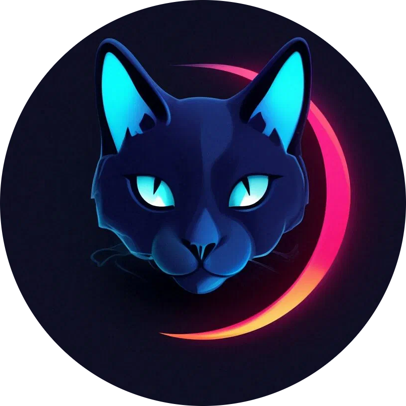

    

<h3 align="center">Simply Chat</h3>

  
<i>A small, lightweight messenger website.</i>

  🢡 <a href="https://github.com/Roma4ka-RedBad/simplychat/issues/new">Report bug or suggest idea.</a> 🢠
    
  

    
    
    
  

  

## Usage
For development and testing, I used the <a href="https://github.com/OSPanel/OpenServerPanel">Open Server</a> software product, it has all the necessary modules for the website to work. You can download it <a href="https://ospanel.io/download/">here</a>.

You can download the database structure dump for the website <a href="https://github.com/Roma4ka-RedBad/simplychat/tree/main/other/simplychat.sql">here</a>.

## Current implemented features
- User аuthentication
- Search for other users by username
- Sending messages
- Activity status (online / offline)
- User blocking, chat clearing, and deletion

## Planned future features
- Group chats
- Uploading images / GIFs for the avatar
- Uploading videos and images in the chat
- Detailed profile customization and display
- Advanced data protection
- Optimization of JS scripts